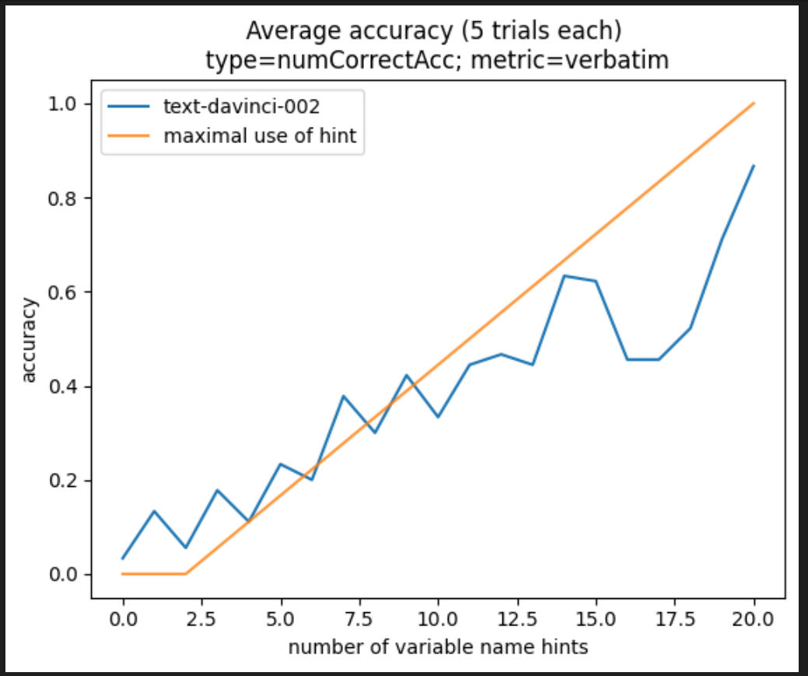
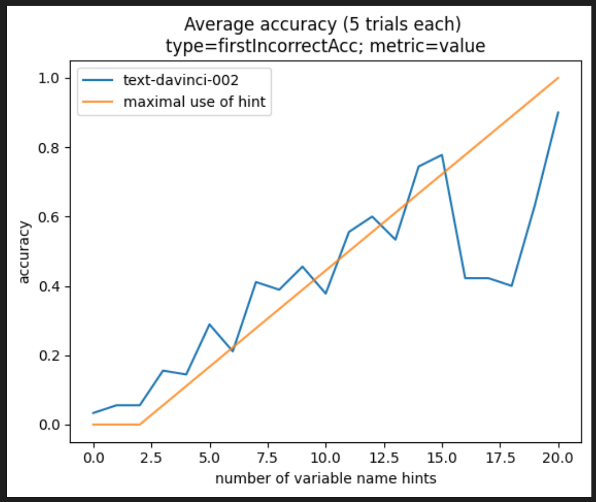

## Goal

This repository analyzes GPT-3's ability to solve reasoning problems when provided a hint. We find that GPT-3's performance scales linearly with the length of the hint when solving the LEGO reasoning task (https://arxiv.org/pdf/2206.04301.pdf), which is evidence that GPT-3 does not store an internal representation of the task, and instead is simply using Induction Heads and other simple circuits to produce a response. We hope to find the exact attention pattern that GPT-3 is using to solve this task.

## Results

We found that performance scales linearly with the length of the provided hint. This is strong evidence that GPT-3 is using a simple attention pattern to produce its results, and does not store an internal representation of the task.

We considered various metrics of correctness (whether the model gave the correct answer verbatim, or whether it gave the correct value) and various measurements of accuracy (the number of values correct, the location of the first incorrect response), and all results have a roughly linear relationship between the  accuracy and hint size.

## Cases

We thoroughly tested edge cases.

- Using various problem sizes (12, 16, and 20 variables)

- Adding spaces and commas between tokens

- Using words as variable names

- Padding the equals sign in the hint

- Padding the equals sign in the system of equations

