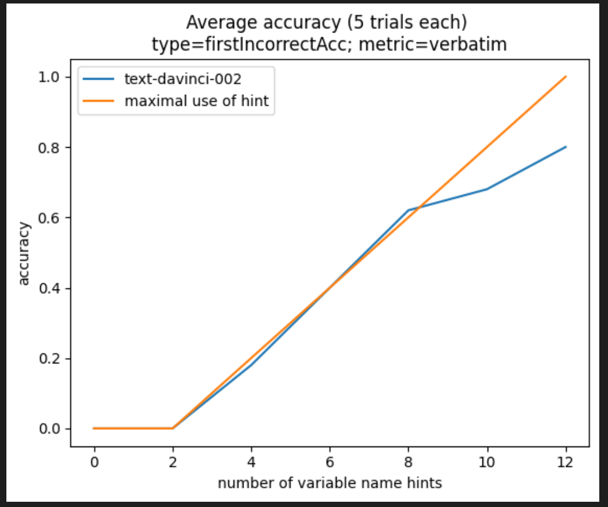

## Goal

Here, we argue that GPT-3 relies on simple attention patterns like the [Induction Head](https://transformer-circuits.pub/2022/in-context-learning-and-induction-heads/index.html) to solve reasoning tasks.
Specifically, we show that GPT-3 uses a consistent method to solve the [LEGO reasoning task](https://arxiv.org/pdf/2206.04301.pdf) on all versions of the task.

We hope to reverse-engineer GPT's attention pattern on this task, and make it human-interpretable. 

## Results

We find that GPT-3's performance scales linearly with the length of the hint it is given, regardless of the size, syntax, or scrambling of the input. This suggests that the model uses the same attention pattern whenever it solves the task.

## Cases

We tested the following cases:

- Using various problem sizes (12, 16, and 20 variables)

- Adding spaces and commas between tokens

- Using words as variable names

- Padding the equals sign in the hint

- Padding the equals sign in the system of equations

